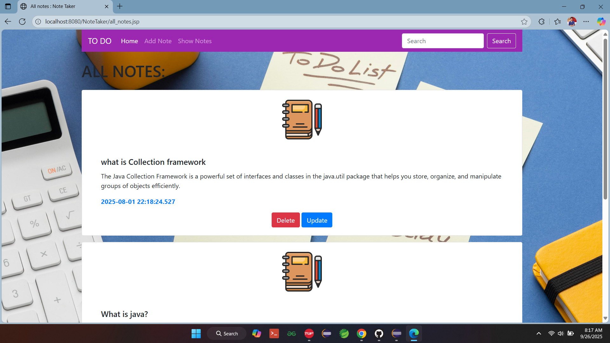
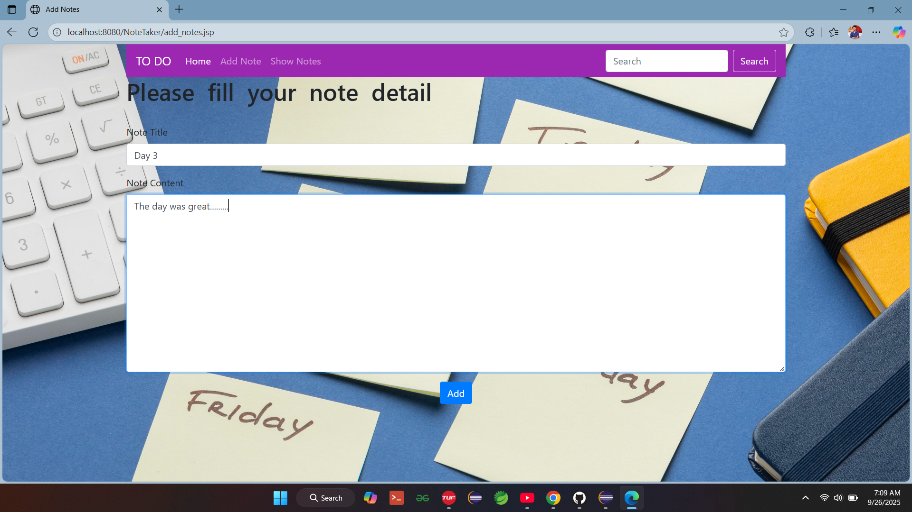
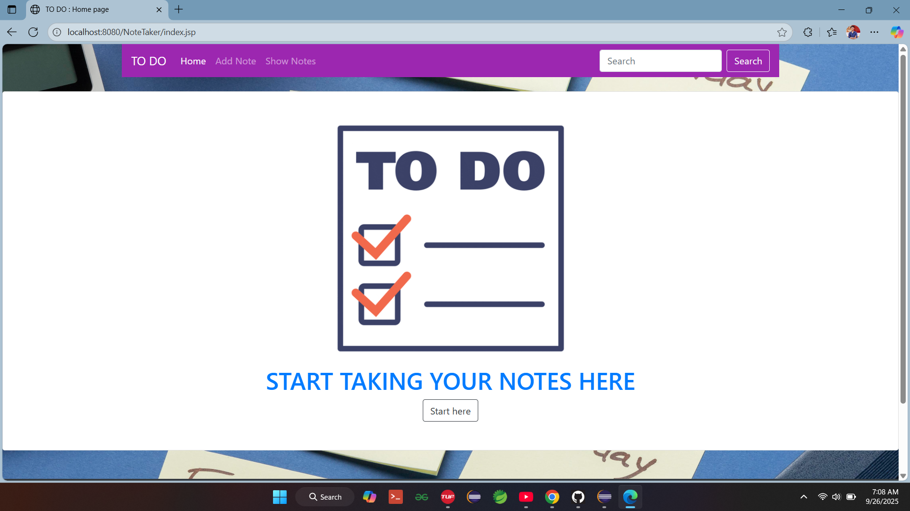

# 📝 To-Do Web Application

A simple and efficient To-Do List web application built using **Spring MVC** for backend logic, **MySQL** for persistent storage, and **Tomcat** as the testing server. This project demonstrates full **CRUD (Create, Read, Update, Delete)** operations in a modular and scalable architecture.

---

## 🚀 Features

- ✅ Add new tasks with title and description
- 📋 View all tasks in a clean UI
- ✏️ Edit existing tasks
- ❌ Delete tasks individually
- 🗃️ Persistent storage using MySQL
- 🔧 MVC architecture with Spring Framework
- 🧪 Tested locally using Apache Tomcat

---

## 🛠️ Tech Stack

| Layer         | Technology       |
|--------------|------------------|
| Frontend     | JSP, HTML, CSS   |
| Backend      | Spring MVC       |
| Database     | MySQL            |
| Server       | Apache Tomcat    |
| ORM          | Hibernate (optional) |
| Build Tool   | Maven            |

---

## 📂 Project Structure

```
src/
├── controller/
│   └── TaskController.java
├── model/
│   └── Task.java
├── dao/
│   └── TaskDAO.java
├── service/
│   └── TaskService.java
├── views/
│   ├── index.jsp
│   ├── addTask.jsp
│   └── editTask.jsp
resources/
└── applicationContext.xml
```

---

## ⚙️ Setup Instructions

1. **Clone the repository**
   ```bash
   git clone https://github.com/your-username/todo-springmvc.git
   cd todo-springmvc
   ```

2. **Configure MySQL**
   - Create a database named `todo_db`
   - Update `applicationContext.xml` or `hibernate.cfg.xml` with your DB credentials

3. **Build the project**
   ```bash
   mvn clean install
   ```

4. **Deploy on Tomcat**
   - Copy the WAR file to Tomcat’s `webapps` directory
   - Start Tomcat and access the app at `http://localhost:8080/todo-springmvc`

---

## 📌 Endpoints Overview

| Action        | URL Path           | Method |
|---------------|--------------------|--------|
| View Tasks    | `/tasks`           | GET    |
| Add Task      | `/tasks/add`       | POST   |
| Edit Task     | `/tasks/edit/{id}` | POST   |
| Delete Task   | `/tasks/delete/{id}` | GET  |

---

## 📖 License

This project is licensed under the MIT License. Feel free to use, modify, and distribute.

---

## 🙌 Acknowledgments

- Spring Framework Documentation
- MySQL Community Edition
- Apache Tomcat
- Maven Build Tool

  ### 📸 Screenshots

#### 🏠 Task List View


#### ➕ Add Task


#### ✏️ UI



